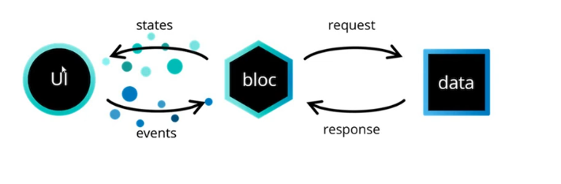

# Introduction To Bloc:

[Pub Dev Link](https://pub.dev/packages/flutter_bloc)

- Stands for Business Object Component
- It is a state management library for flutter
- Allows us to separate Business Logic With UI Layer.


## Components of BLoC:

- Events
- Bloc
- State

UI layer sends events to the BLoC
BLoC processes the events and emits new states
UI layer listens to the states and updates the UI accordingly

## Process Flow



- User clicks on a button to get a list of products.
- The event fires and tells the BlOC that user wants the list of products.
- Bloc requests the data.
- If the Bloc has data then it emits a state. [Success Or Failure]
- UI listens to the states and updates the UI accordingly.

## Bloc Widgets:

[Bloc Widget Docs](https://pub.dev/packages/flutter_bloc#bloc-widgets)

Following are the components of Bloc:

- **Bloc Builder**: It is used to listen to the state of the bloc and rebuild the UI based on the state.
- **Bloc Selector**: It is used to listen to the state of the bloc and rebuild the UI based on the selected state.
- **Bloc Provider**: It is used to provide the bloc to the widget tree.
- **MultiBlocProvider**: It is used to provide multiple blocs to the widget tree.
- **BlocListener**: It is used to listen to the state of the bloc and perform side effects.
- **MultiBlocListener**: It is used to listen to the state of multiple blocs and perform side effects.
- **BlocConsumer**: It is used to listen to the state of the bloc and rebuild the UI based on the state.
- **RepositoryProvider**: It is used to provide the repository to the widget tree.
- **MultiRepositoryProvider**: It is used to provide multiple repositories to the widget tree.
- **MultiBlocConsumer**: It is used to listen to the state of multiple blocs and rebuild the UI based on the state.


## Example Usage:

**counter_cubit.dart**

```dart
import 'package:flutter_bloc/flutter_bloc.dart';

class CounterCubit extends Cubit<int> {
  CounterCubit() : super(0);

  void increment() => emit(state + 1);
  void decrement() => emit(state - 1);
}
```

**main.dart**

```dart
import 'package:flutter/material.dart';
import 'package:flutter_bloc/flutter_bloc.dart';
import 'counter_cubit.dart';

void main() => runApp(CounterApp());

class CounterApp extends StatelessWidget {
  @override
  Widget build(BuildContext context) {
    return MaterialApp(
      home: BlocProvider(
        create: (_) => CounterCubit(),
        child: CounterPage(),
      ),
    );
  }
}
```

**counter_page.dart**

```dart
import 'package:flutter/material.dart';
import 'package:flutter_bloc/flutter_bloc.dart';
import 'counter_cubit.dart';

class CounterPage extends StatelessWidget {
  @override
  Widget build(BuildContext context) {
    return Scaffold(
      appBar: AppBar(title: const Text('Counter')),
      body: BlocBuilder<CounterCubit, int>(
        builder: (context, count) => Center(child: Text('$count')),
      ),
      floatingActionButton: Column(
        crossAxisAlignment: CrossAxisAlignment.end,
        mainAxisAlignment: MainAxisAlignment.end,
        children: <Widget>[
          FloatingActionButton(
            child: const Icon(Icons.add),
            onPressed: () => context.read<CounterCubit>().increment(),
          ),
          const SizedBox(height: 4),
          FloatingActionButton(
            child: const Icon(Icons.remove),
            onPressed: () => context.read<CounterCubit>().decrement(),
          ),
        ],
      ),
    );
  }
}
```